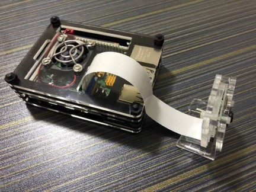

## About
This repo contains some notes on how to play with Raspberry PI 4.

This is my Raspberry PI 4B (4G Ram) with a CSI camera.

## Topics

- [Get Started](docs/START.md)

- [Basic Configuration](docs/CONFIG.md)

- [Useful Tools](docs/TOOLS.md)

- [Use CSI Camera](docs/CAMERA.md)

- [Use USB Camera and Microphone](docs/USB.md)

- [Install Tensorflow Lite](docs/TFLITE.md)

- [Object Detection](docs/DETECT.md)

- [Image Classification](docs/CLASSIFY.md)

- [OpenCV and Face Detection](docs/OPENCV.md)

