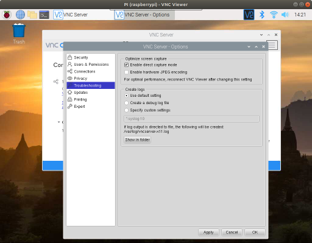

# Image Classification 

Test image classfication using Tensorflow Lite. Make sure Tensorflow Lite interpreter is installed.

## Reference

This is the official example from Tensorflow Lite

https://github.com/tensorflow/examples/blob/master/lite/examples/image_classification/raspberry_pi/README.md

## Get the TFLite model

Download the model and place it in the data subfolder

```bash
cd python

curl -O https://storage.googleapis.com/download.tensorflow.org/models/tflite/mobilenet_v1_1.0_224_quant_and_labels.zip

unzip mobilenet_v1_1.0_224_quant_and_labels.zip -d data

rm mobilenet_v1_1.0_224_quant_and_labels.zip
```

## Run image classification

To run a test (You must have CSI camera installed)

```bash
python3 image_classification.py
```

Put a photo to the camera.


You need to connect to a monitor via HMDI in order to see the camera preview screen, if you are using VNC, you can go to 'VNC Server - Options' > Troubleshooting,  check the 'Enable direct capture model'

