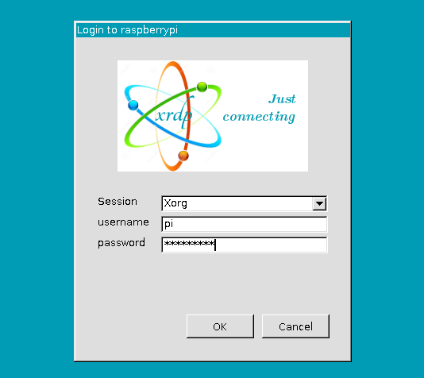
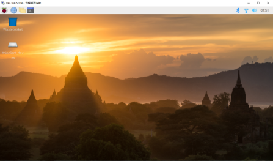

# Basic Configuration


## Update Sources List

- Run `sudo vi /etc/apt/sources.list`

Content as below:
```
deb http://mirrors.tuna.tsinghua.edu.cn/raspbian/raspbian/ buster main non-free contrib
deb-src http://mirrors.tuna.tsinghua.edu.cn/raspbian/raspbian/ buster main non-free contrib
```

- Run `sudo vi /etc/apt/sources.list.d/raspi.list`

Content as below:
```
deb http://mirrors.tuna.tsinghua.edu.cn/raspberrypi/ buster main ui
```

- Get updates

Run bash
```
sudo apt update
sudo apt upgrade
```


## Enable VNC

To enable VNC, run

```
sudo raspi-config
```
Select Interfacing Options > VNC > Yes

Wait until you see 'The VNC Server is enabled'


Then change the resolution: Select Advanced Options > A5 Resolution

Reboot

Run `ifconfig` via ssh or `ping -4 raspberrypi.local` to check the ip address of Raspberry Pi, then connect to Raspberry Pi via VNC Viewer.


## Enable Remote Desktop

To enable remote desktop connection (from Windows), run

```
sudo apt install xrdp
```

Open a connection, login with pi



Login successfully.



> You can run `sudo service xrdp status` to check the status