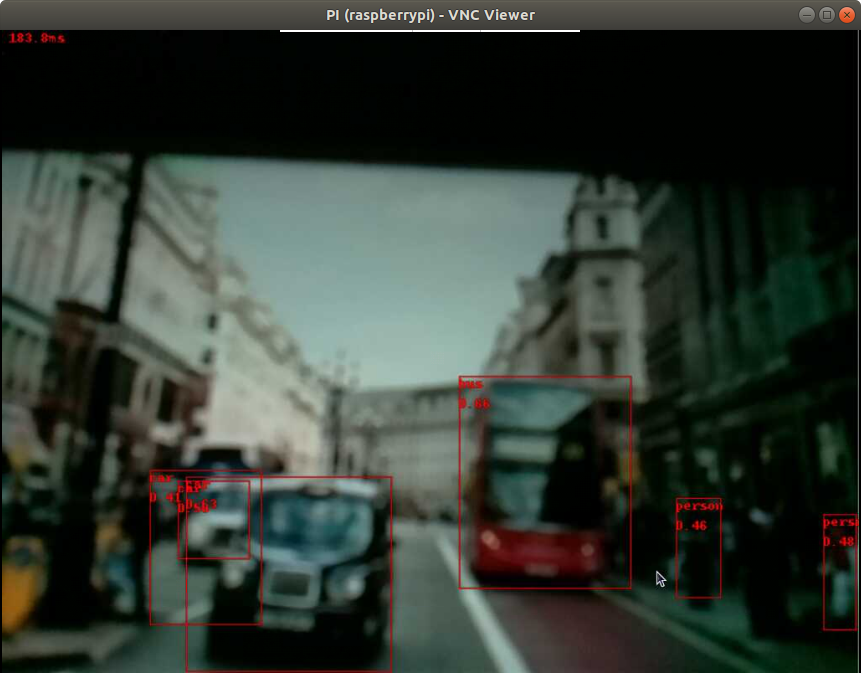
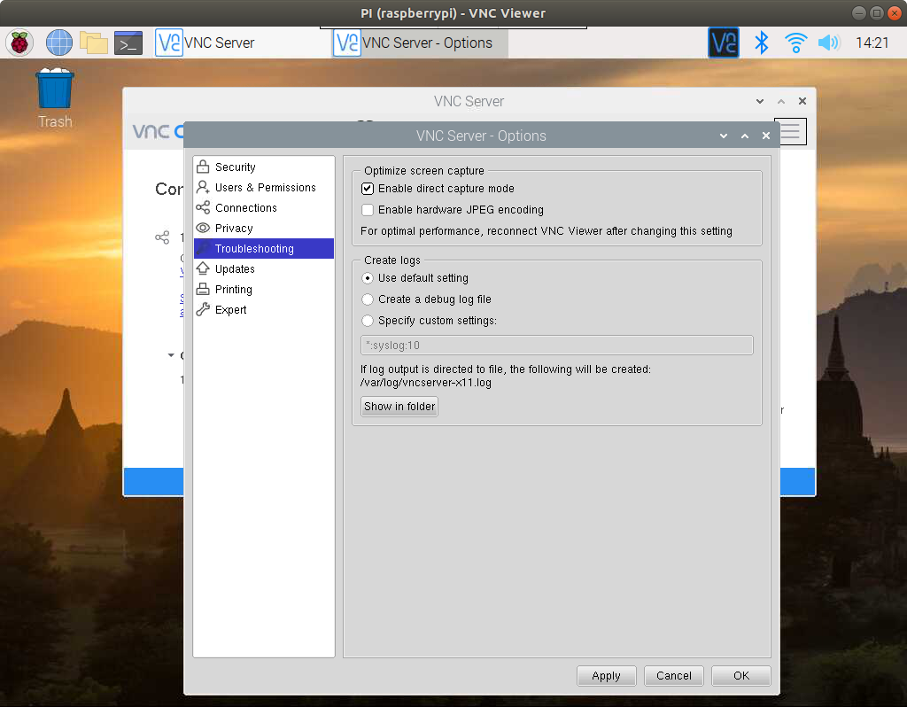

# Object detection 

Test object detection using Tensorflow Lite. Make sure Tensorflow Lite interpreter is installed.

## Reference

This is the official example from Tensorflow Lite

https://github.com/tensorflow/examples/blob/master/lite/examples/object_detection/raspberry_pi/README.md


## Get the TFLite model

Download the model and place it in the data subfolder

```bash
cd python

curl -O http://storage.googleapis.com/download.tensorflow.org/models/tflite/coco_ssd_mobilenet_v1_1.0_quant_2018_06_29.zip

unzip coco_ssd_mobilenet_v1_1.0_quant_2018_06_29.zip -d data

rm coco_ssd_mobilenet_v1_1.0_quant_2018_06_29.zip
```

## Run object detection

To run a test (You must have CSI camera installed)

```bash
python3 object_detection.py
```

Put a photo to the camera.



You need to connect to a monitor via HMDI in order to see the camera preview screen, if you are using VNC, you can go to 'VNC Server - Options' > Troubleshooting,  check the 'Enable direct capture model'

