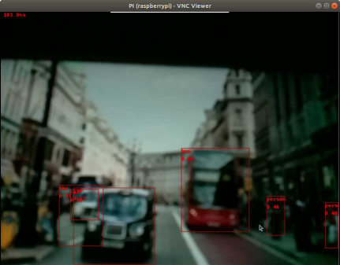

# Object detection 

Test object detection using Tensorflow Lite. Make sure Tensorflow Lite interpreter is installed.

## Reference

This is the official example from Tensorflow Lite

https://github.com/tensorflow/examples/blob/master/lite/examples/object_detection/raspberry_pi/README.md

## Run

The pre-trained model and labels have been included. To run a test:

```bash
cd python
python3 object_detection.py
```

Example



You need to connect to a monitor via HMDI in order to see the camera preview screen, if you are using VNC, you can go to 'VNC Server - Options' > Troubleshooting,  check the 'Enable direct capture model'

