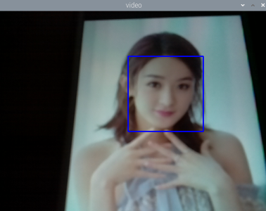

# OpenCV and Face Detection

## Install OpenCV

- Option 1:  Use apt install

Get updates, and then run
```
sudo apt install python3-opencv
```

This seems to be the easist way to install opencv, but the version installed is 3.2.0 which is out-of-dated.


- Option 2:  Use pip wheel

Install required packages
```
sudo apt-get install -y libjasper-dev libqtgui4 libqt4-test

sudo apt-get install -y libatlas3-base
```

It's very slow to directly run pip3 install, so we need to download the wheel first, then run the install from local.

Download from: 
https://www.piwheels.org/simple/opencv-python/opencv_python-4.1.1.26-cp37-cp37m-linux_armv7l.whl#sha256=f600ca8c1ba09c8f974b322bfd23662971cb051ab41ff2278042622c201c6a2a

Then run pip install
```bash
python3 -m pip install opencv_python-4.1.1.26-cp37-cp37m-linux_armv7l.whl
```

For openCV 4, you need one more step, add below line to .bashrc
```
export LD_PRELOAD=/usr/lib/arm-linux-gnueabihf/libatomic.so.1 
```

Then you can test the installation


## Face detection

There are quite a lot of examples from Github, you can refer to https://github.com/Mjrovai/OpenCV-Face-Recognition

Download and run the faceDetection.py, Comment out the line `img = cv2.flip(img, -1)`, you don't need to rotate the camera

Test run:




