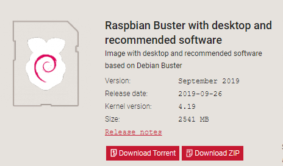

# Get Started

System installation and basic setup

## Reference

Offical Guide: https://www.raspberrypi.org/documentation/installation/installing-images/README.md


## Download Image

Go to website: https://www.raspberrypi.org/downloads/raspbian/

Download 'Raspbian Buster with desktop and recommended software' and Unzip the file after downloaded.



## Write Image to MicroSD card

Use the balenaEtcher tool as recommended:


> Note: There are many other tools that can be used, like Rufus

## Enable SSH

To enable SSH while started, mount the boot drive, create two files in the root folder: 


1. ssh (or SSH)

Blank file, This will enable SSH by default.

2. wpa_supplicant.conf

This file is for wifi connection, create a file with content as below:

```
country=CN
ctrl_interface=DIR=/var/run/wpa_supplicant GROUP=netdev
update_config=1

network={
	ssid="<your wifi>"
	psk="<your wifi password>"
	key_mgmt=WPA-PSK
	priority=1
}
```

> Change the wifi and password to your own one.

Once done, install the SD card into Raspberry, and then connect to Power to start

Connect via SSH (You don't need to know the ip address if your computer connects to the same wifi)

```
ssh pi@raspberrypi.local
```

> The default password is `raspberry`


