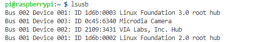
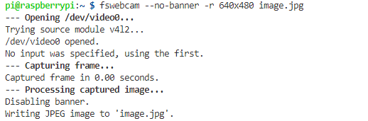
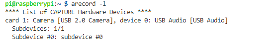
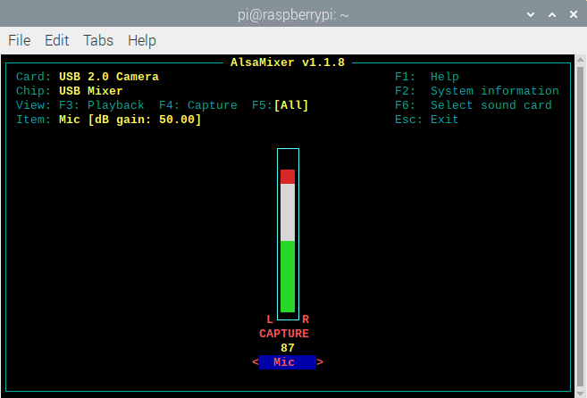

# Use USB Camera and Microphone

Run `lsusb` to see the device, here I got the Microdia Camera, which is my USB camera (with microphone)



## USB camera

Install fswebcam

```bash
sudo apt-get install fswebcam
```

To capture image,  run `faswebcam --help` to get more details. For example:
```bash
fswebcam --no-banner -r 640x480 image.jpg
```


> Note: USB camera works well with opencv.


## USB Microphone

Run `arecord -l` to see the audio device



To capture an audio, for example
```bash
arecord -D "plughw:1,0" -f dat -c 1 -r 16000 -d 5 test.wav
```

To adjust the microphone volume, run `alsamixer -c 1`, then press F5.



Run `arecord --help` to get more details.

